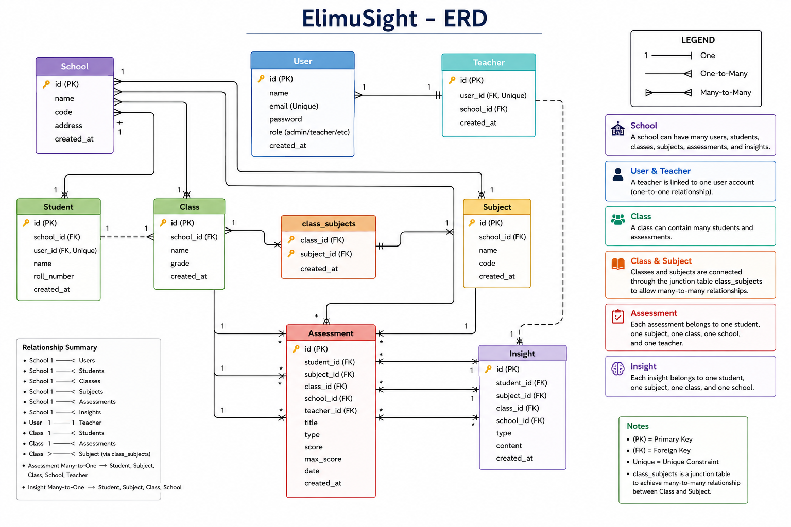

# ElimuSight API

> AI-Powered School Intelligence Platform Backend

---

## 🧠 Overview

ElimuSight API is the backend service powering the ElimuSight platform — an AI-driven school intelligence system focused on transforming raw school data into actionable intelligence.

The platform helps schools:

- Analyze student performance
- Detect learning gaps
- Generate AI-powered insights
- Improve CBC tracking
- Support teacher interventions
- Build data-driven learning environments

---

## 🌍 Vision

Many schools collect large amounts of academic data but lack systems that transform that data into actionable intelligence.

ElimuSight bridges that gap by combining educational analytics with AI-powered insights to help teachers, schools, and administrators make smarter academic decisions.

---

## 🚀 Tech Stack

| Technology | Purpose |
|---|---|
| TypeScript | Type-safe backend development |
| Node.js | Runtime environment |
| Express.js | API framework |
| PostgreSQL | Primary database |
| Prisma ORM | Database access |
| JWT | Authentication |
| Joi | Validation |
| Winston | Logging |
| Morgan | HTTP request logging |
| OpenAI API | AI-generated insights |

---

## 🏗️ System Design

[View System Design Analysis](docs/system_design.md)

---

## 📁 Project Structure

```bash
apps/api/
│
├── prisma/                     # Database schema & migrations
│
├── src/
│   │
│   ├── ai/                     # AI services
│   │   └── ai.service.ts
│   │
│   ├── config/                 # Application configuration
│   │
│   ├── controllers/            # Request handlers
│   │
│   ├── mappers/                # DTO transformation layer
│   │
│   ├── middlewares/            # Express middlewares
│   │
│   ├── routes/                 # API routes
│   │
│   ├── schemas/                # Joi validation schemas
│   │
│   ├── services/               # Business logic layer
│   │   ├── assessment.service.ts
│   │   ├── auth.service.ts
│   │   ├── class-subject.service.ts
│   │   ├── class.service.ts
│   │   ├── insight.service.ts
│   │   ├── school.service.ts
│   │   ├── student.service.ts
│   │   ├── subject.service.ts
│   │   ├── user.service.ts
│   │   └── index.ts
│   │
│   ├── tests/                  # Tests
│   │
│   ├── types/
│   │   └── express.d.ts
│   │
│   ├── utils/                  # Shared utilities
│   │   ├── analytics.ts
│   │   ├── app-error.ts
│   │   ├── constants.ts
│   │   ├── hash.ts
│   │   ├── jwt.ts
│   │   ├── logger.ts
│   │   ├── prisma.ts
│   │   ├── response.ts
│   │   └── index.ts
│   │
│   ├── app.ts
│   └── server.ts
│
├── .env
├── .gitignore
├── package.json
├── README.md
└── tsconfig.json
```

---

## 🧠 Architecture Style

ElimuSight follows a:

- Layered Modular Monolith Architecture
- Service-Layer Pattern
- DTO / Mapper Pattern
- Middleware Pipeline Pattern

The system is designed for scalability, maintainability, and future AI-driven educational analytics.

---

## 🗄️ Database Design

ElimuSight uses a relational database built with:

- PostgreSQL
- Prisma ORM

The database is designed for:

- Multi-school management
- CBC assessment tracking
- AI-powered insights
- Fast querying
- Future scalability

---

## 🧠 Design Approach

The database follows a:

> Multi-Tenant SaaS Architecture

Each school is isolated using:

```txt
school_id
```

This ensures secure school-level data separation.

---

## 🧩 Core Tables

| Table | Purpose |
|---|---|
| schools | Stores school information |
| users | Stores system users |
| teachers | Teacher profiles |
| classes | Academic classes |
| students | Student records |
| subjects | School subjects |
| class_subjects | Links classes and subjects |
| assessments | Student marks and grades |
| insights | AI-generated insights |
| ai_logs | AI request and response logs |

---

## 🔗 Relationship Types

### 🏫 School Relationships

| Entity | Relationship Type | Related Entities | Description |
|---|---|---|---|
| School | One-to-Many | Users, Students, Classes, Subjects, Assessments, Insights | A school manages multiple academic and system entities |

**Example**

```txt
One School → Many Students
```

---

### 👤 User & Teacher Relationships

| Entity | Relationship Type | Related Entity | Description |
|---|---|---|---|
| User | One-to-One | Teacher | Each teacher is linked to exactly one user account |

**Example**

```txt
One User ↔ One Teacher
```

---

### 🎓 Class Relationships

| Entity | Relationship Type | Related Entities | Description |
|---|---|---|---|
| Class | One-to-Many | Students, Assessments | A class contains multiple students and assessments |

**Example**

```txt
One Class → Many Students
```

---

### 📚 Class & Subject Relationships

| Entity | Relationship Type | Related Entities | Description |
|---|---|---|---|
| Class ↔ Subject | Many-to-Many | class_subjects | Classes can have many subjects and subjects can belong to many classes |

**Junction Table**

```txt
Classes → class_subjects ← Subjects
```

---

### 📊 Assessment Relationships

| Entity | Relationship Type | Related Entities | Description |
|---|---|---|---|
| Assessment | Many-to-One | Student, Subject, Class, School, Teacher | Each assessment belongs to one student, subject, class, school, and teacher |

Supports:

- Analytics
- Reporting
- AI insights

---

### 🧠 Insight Relationships

| Entity | Relationship Type | Related Entities | Description |
|---|---|---|---|
| Insight | Many-to-One | Student, Subject, Class, School | Insights are generated within a student academic context |

Used for:

- Recommendations
- Predictions
- Learning analysis

---

## 📊 Entity Relationship Diagram (ERD)



---

## ⚡ Performance Optimization

The database is optimized using indexes.

### Indexed Fields

- school_id
- student_id
- class_id
- subject_id
- email

### Benefits

- Faster filtering
- Better dashboard performance
- Improved analytics queries

---

## 🧠 UUID IDs

All tables use UUIDs.

### Benefits

- Better scalability
- Safer APIs
- Easier distributed systems support

---

## 🚀 Quick Start

### Option 1 — Docker (easiest)

```bash
# 1. Copy environment config
cp .env.example .env
# Edit .env with your database credentials

# 2. Start all services
docker compose up
```

The API starts at `http://localhost:3000`.

Docker Compose runs the API, PostgreSQL (with health check), and wires the AI service URL automatically.

---

### Option 2 — Local Development

**Prerequisites:** Node.js v18+, PostgreSQL 15+

```bash
# 1. Navigate to API
cd apps/api

# 2. Install dependencies
npm install

# 3. Copy and configure environment
cp .env.example .env
# Edit .env with your PostgreSQL credentials and other settings

# 4. Generate Prisma client and run migrations
npx prisma generate
npx prisma migrate dev

# 5. Start in development mode (auto-reloads on changes)
npm run dev
```

The API runs on `http://localhost:5000`.

---

### Running the AI Service (optional)

The AI insight generation requires the Python FastAPI service:

```bash
cd apps/ai-service
source venv/bin/activate
uvicorn app.main:app --reload --port 8000
```

---

## 📦 Available Scripts

| Script | Description |
|--------|-------------|
| `npm run dev` | Start dev server with hot reload |
| `npm run build` | Compile TypeScript to JavaScript |
| `npm start` | Run compiled production build |
| `npm test` | Run tests |
| `npm run test:coverage` | Run tests with coverage report |
| `npm run test:watch` | Run tests in watch mode |

---

## 🧠 Architecture

ElimuSight uses a layered backend architecture:

```txt
Routes
  ↓
Middlewares
  ↓
Controllers
  ↓
Services
  ↓
Prisma ORM
  ↓
PostgreSQL
```

---

## 📦 API Response Format

### Successful Response

```json
{
  "success": true,
  "message": "Student retrieved successfully",
  "data": {}
}
```

### Error Response

```json
{
  "success": false,
  "message": "Validation failed",
  "errors": []
}
```

---

## 🔌 Core Modules

### 🔐 Authentication

Handles:

- User login
- JWT + refresh token rotation
- Role-based access control

#### Endpoints

```http
POST /api/v1/auth/login
POST /api/v1/auth/refresh
POST /api/v1/auth/logout
```

---

### 👨‍🎓 Students

Handles:

- Student profiles
- Student records
- Student management

#### Endpoints

```http
GET    /api/v1/students
GET    /api/v1/students/:id
POST   /api/v1/students
PATCH  /api/v1/students/:id
DELETE /api/v1/students/:id
```

---

### 📊 Assessments

Handles:

- CBC assessments
- Student marks
- Strand performance

#### Endpoints

```http
GET    /api/v1/assessments/school/:schoolId
GET    /api/v1/assessments/school/:schoolId/count
GET    /api/v1/assessments/school/:schoolId/exam-type/:examType
POST   /api/v1/assessments
PATCH  /api/v1/assessments/school/:schoolId/:id
DELETE /api/v1/assessments/school/:schoolId/:id
```

---

### 🧠 AI Insights

Handles:

- Class, student, and subject insight generation
- Bulk insight generation
- AI service health checks

#### Endpoints

```http
POST /api/v1/ai/generate/class
POST /api/v1/ai/generate/student
POST /api/v1/ai/generate/subject
POST /api/v1/ai/refresh
POST /api/v1/ai/bulk
GET  /api/v1/ai/health
```

---

### 💡 Insights

Handles:

- Generated student insights
- Recommendations storage
- Learning analytics

#### Endpoints

```http
GET    /api/v1/insights/crud/:id
POST   /api/v1/insights/crud
PATCH  /api/v1/insights/crud/:id
DELETE /api/v1/insights/crud/:id
GET    /api/v1/insights/query/school/:schoolId
POST   /api/v1/insights/query/archive
POST   /api/v1/insights/query/bulk-generate
GET    /api/v1/insights/analytics/class/:classId
GET    /api/v1/insights/analytics/student/:studentId
GET    /api/v1/insights/analytics/subject/:subjectId
GET    /api/v1/insights/analytics/type/:type
GET    /api/v1/insights/analytics/period/:period
```

---

## 🔄 System Workflow

```txt
Teacher submits assessment data
        ↓
API validates request
        ↓
Data stored in PostgreSQL
        ↓
AI analysis pipeline triggered
        ↓
Insights generated
        ↓
Insights persisted
        ↓
Dashboard visualizes intelligence
```

---

## 🛡️ Security

The API includes:

- JWT authentication
- Password hashing with bcrypt
- Helmet security middleware
- Request validation with Joi
- Protected environment variables
- CORS configuration

---

## 📜 Logging

Logging is handled using:

- Winston
- Morgan
- Winston Daily Rotate File

Logs include:

- API requests
- Errors
- System events

---

## 🧩 Validation

Validation is handled using:

```txt
Joi
```

Schemas are located inside:

```bash
src/schemas/
```

---

## ⚙️ Infrastructure Features

- Centralized error handling
- Async request handling
- Request logging
- Environment-based configuration
- Validation middleware
- JWT middleware

---

## 🧪 Testing

```bash
npm test
npm run test:coverage  # with coverage report
```

---

## 🔌 Testing API Endpoints (Postman / curl)

### Authentication

1. Login to get a JWT token:

```bash
curl -X POST http://localhost:5000/api/v1/auth/login \
  -H "Content-Type: application/json" \
  -d '{"email": "admin@school.com", "password": "yourpassword"}'
```

2. Use the returned token in subsequent requests:

```bash
curl -H "Authorization: Bearer <token>" http://localhost:5000/api/v1/schools
```

### Key Endpoints

| Method | Endpoint | Auth Required | Roles |
|--------|----------|---------------|-------|
| POST | `/api/v1/auth/login` | No | — |
| GET | `/api/v1/schools` | Yes | All |
| GET | `/api/v1/students` | Yes | All |
| GET | `/api/v1/assessments/school/:schoolId` | Yes | All |
| POST | `/api/v1/assessments` | Yes | ADMIN, HEADTEACHER, TEACHER |
| PATCH | `/api/v1/assessments/school/:schoolId/:id` | Yes | ADMIN, HEADTEACHER |
| DELETE | `/api/v1/assessments/school/:schoolId/:id` | Yes | ADMIN, HEADTEACHER |
| POST | `/api/v1/ai/generate/class` | Yes | ADMIN, HEADTEACHER, TEACHER |
| POST | `/api/v1/ai/generate/student` | Yes | ADMIN, HEADTEACHER, TEACHER |
| POST | `/api/v1/ai/generate/subject` | Yes | ADMIN, HEADTEACHER, TEACHER |
| POST | `/api/v1/ai/bulk` | Yes | ADMIN, HEADTEACHER |
| GET | `/api/v1/ai/health` | Yes | ADMIN |
| GET | `/api/v1/insights/crud/:id` | Yes | All |
| GET | `/api/v1/insights/query/school/:schoolId` | Yes | All |
| GET | `/api/v1/insights/analytics/class/:classId` | Yes | All |
| GET | `/health` | No | — |

### AI Endpoints — Example

```bash
curl -X POST http://localhost:5000/api/v1/ai/generate/class \
  -H "Content-Type: application/json" \
  -H "Authorization: Bearer <token>" \
  -d '{"classId": "uuid-here", "schoolId": "uuid-here"}'
```

### Rate Limiting

| Tier | Limit |
|------|-------|
| Global | 100 requests / 15 min |
| Auth | 10 requests / 15 min |
| AI | 20 requests / 15 min |

---

## 🚀 MVP Goals

The initial MVP focuses on:

- CBC analytics
- Student intelligence
- AI-powered recommendations
- Teacher intervention insights

---

## ⚖️ Architectural Trade-Offs

[View Architectural Trade-Offs](docs/architectural_trade_offs.md)

---

## 📈 Scalability Strategy

### Phase 1 — MVP

- Single PostgreSQL database
- Supports 10–50 schools

---

### Phase 2 — Growth

Add:

- Redis caching
- Read replicas
- Query optimization

Supports:

- Hundreds of schools

---

### Phase 3 — Large Scale SaaS

Add:

- Table partitioning
- Tenant sharding
- Background workers

Supports:

- Thousands of schools

---

## 🔮 Future Architecture Evolution

Planned improvements include:

- Feature-based modularization
- Background job queues
- Redis caching
- Event-driven insight processing
- AI worker services
- Read replicas for analytics

---

## 🛣️ Future Roadmap

- Multi-school SaaS architecture
- Parent portal
- School-wide analytics dashboards
- AI tutoring assistant
- SMS/WhatsApp notifications
- Mobile app integration
- Real-time insights

---

## 👤 Author

Elaine Muhombe

Built to advance data-driven education intelligence across African schools.

---

# ElimuSight

> Transforming school data into actionable intelligence.